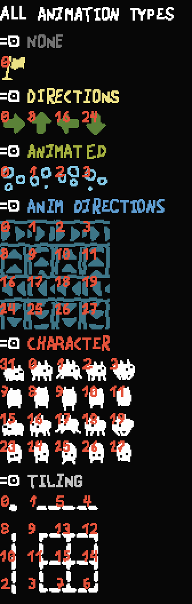

# Adding custom sprites to the editor object list

To clarify, this guide shows how to add a sprite to the editor menu that appears when adding an object to the palette. You would be able to select your custom object from the list and use it in the level editor as normal.

## Spriting Basics
If you have [Aseprite](https://www.aseprite.org/) (which is a really good pixel art program btw), I made a [script](https://github.com/PlasmaFlare/baba-aseprite-export) that handles importing/exporting baba sprites without having to worry about the technical naming scheme I'll detail below.

The basic format of a single sprite file is:
```
<name>_<state>_<wobble>.png
```
- `<name>` - the name of the object that is using this sprite. Has to match unit.strings[UNITNAME]. (See [Units](../references/units.md)). Text objects have "text_" prepended (Ex: "text_push", "text_baba")
- `<state>` - A number between 0-31 that determines which set of sprites to display. (See below gif)
- `<wobble>` - A number between 1-3. The game cycles from 1-3 to display a wobble animation with the current `<state>.`

The set of png files needed for an object depends on the object's [animation style](../references/editor_obj_settings.md#animation-style). For each animation style, a set of `<state>`'s are required. And for each state, all `<wobble>` values are needed.

So if `<name> = baba` and its animation style requires a `<state>` of 9, then the following pngs are required:
```
baba_9_1.png, baba_9_2.png, baba_9_3.png
```
With that explained, here's an excellent infographic from @Dark_Brick#0969 about which `<state>`'s are needed for each animation type:


## Adding your object to the editor
Most of this section comes from `<baba install dir>\Data\Worlds\debug\Lua\tutorial.lua`. I'll post the relevant code snippet here (also added letter labels for reference):
```lua
-- Here we add two new objects to the object list

table.insert(editor_objlist_order, "tuto") -- (A)
table.insert(editor_objlist_order, "text_tuto")

-- This defines the exact data for them (note that since the sprites are specific to this levelpack, sprite_in_root must be false!)

-- (B)
editor_objlist["tuto"] = 
{
	name = "tuto",
	sprite_in_root = false,
	unittype = "object",
	tags = {"abstract"},
	tiling = -1,
	type = 0,
	layer = 20,
	colour = {0, 3},
}

editor_objlist["text_tuto"] = 
{
	name = "text_tuto",
	sprite_in_root = false,
	unittype = "text",
	tags = {"text","abstract"},
	tiling = -1,
	type = 0,
	layer = 20,
	colour = {0, 2},
	colour_active = {0, 3},
}

-- After adding new objects to the list, formatobjlist() must be run to setup everything correctly.

formatobjlist() -- (C)
```

The above code adds a custom object and its text variant to the editor objectlist. It has the necessary sprites added to the folder `<levelpack folder>/Sprites`. (A) defines the order the objects appear when browsing the list of objects to add. (B) defines the object's base properties. (C) is required after both (A) and (B) because it uses editor_objlist to set up an additional reference table.

A brief rundown of (B)'s properties. Some good references: [Common Object Properties](../references/editor_obj_settings.md) and [Units](../references/units.md)
- **name** - the name of the object. Equal to unit.strings[UNITNAME]. The sprite files have to be prefixed with this string.
- **sprite_in_root** - Usually you set to `false`. If `true`, the game will look at `<baba install dir>/Data/Sprites` for the sprite. If `false`, the game will look at `<levelpack folder>/Sprites` for your sprite.
- **unittype** - the unit's type. Usually either "object" or "text".
- **tags** - the set of level editor tags this object belongs to.
- **tiling** - the animation style. Equal to unit.values[TILING].
- **type** - the text type. Equal to unit.values[TYPE]
- **layer** - the z-layer. Equal to unit.values[ZLAYER]
- **colour** - the color of the object. If the object is text, it's the color when inactive.
- **colour_active** - If the object is text, it's the color when active.