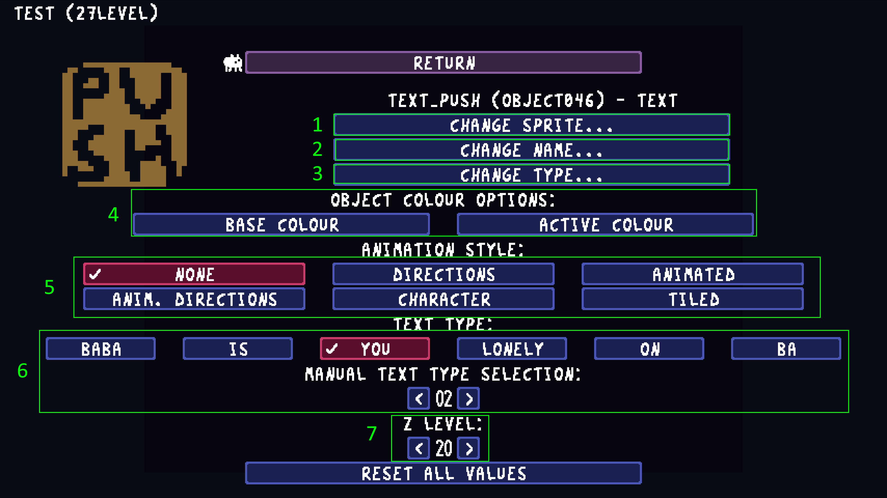
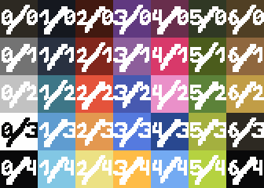

# Common object properties
The editor object settings menu introduces a few common properties shared by objects.



### References
1) Sprite of the object.
2) Name of object. This corresponds with [unit.strings[NAME]](../references/units.md#unitstrings)
3) Overall type of the object. This corresponds with [unit.strings[UNITTYPE]](../references/units.md#unitstrings)
4) [Color](#color) of the object. For text blocks, there will be two colors, one for inactive and one for active.
5) [Animation Style](#animation-style). This corresponds with [unit.values[TILING]](../references/units.md#unitvalues)
6) [Text type](#text-type). This corresponds with [unit.values[TYPE]](../references/units.md#unitvalues).
7) Z Layer. This corresponds with [unit.values[ZLAYER]](../references/units.md#unitvalues)


## Color
Colors in Baba Is You are based on a palette that is defined from a 7x5 image. In the game's code, each palette color is represented by `{x, y}`, corresponding to the coordinates of the palette as seen below. For instance, `{0, 3}` refers to white. [getcolour()](../references/units.md#getcolour) is commonly used in Lua to get an object's current color.

(Credit to @DreamVoyager + ROBOT IS YOU bot)



## Animation Style
The animation style option defines how the sprite changes in response to in game actions. This corresponds with [unit.values[TILING]](../references/units.md#unitvalues). Each style has a number associated with it (shown in parentheses).
- **None (-1)** - sprite remains the same (Ex: rock, flag, box)
- **Directional (0)** - sprite changes based on the direction it is facing (Ex: ghost, skull, hand)
- **Animated (4)** - sprite changes at every turn, no directional sprites (Ex: bubble, cog, bat)
- **Anim Directions (3)** - sprite changes at every turn, but the sequence of sprites is determined by the direction (Ex: belt)
- **Character (2)** - sprite changes whenever the object moves. Sequence of sprites is influenced by direction. Also has sleep sprites. (Ex: baba, keke, me)
- **Tiled (1)** - sprite changes based on if its near other objects of the same sprite (Ex: wall, brick, fence)

## Text Type
When the object is a text block (defined by setting #3 in the editor picture to "text"), the text type defines the text's syntax in relation to other text blocks. This corresponds with [unit.values[TYPE]](../references/units.md#unitvalues). Each type has a number associated with it.

```
0 = noun (Ex: baba, keke, fence)
1 = verb (Ex: is, has, make)
2 = property (Ex: push, stop, you)
3 = prefix condition (Ex: lonely, idle, seldom)
4 = not
5 = letter - includes partial texts like "ba" or "ab"
6 = and
7 = infix condition (Ex: on, near, facing)
```
