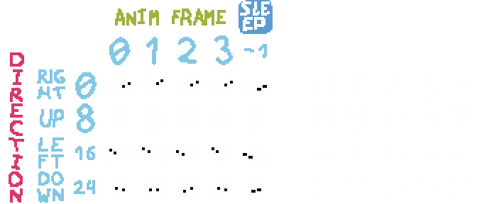

# Units
A unit is the most basic game object. It can represent almost anything you see in Baba Is You. For this guide's purposes though, a unit represents an object in the current level (such as baba, grass, text_baba, level, etc).

Each unit has a unitid, which is a unique number identifying the unit. Another term for it is a "fixed" value, but I'll use "unitids" since it's less confusing. The actual value of a unitid doesn't matter except to MMF (the game engine baba was developed on). Unitids are useful for referring to units without having to store a lot of data. To get a unit from a unitid, `mmf.newObject(unitid)` is commonly used. (See [Common functions/members](#common-functionsmembers))

## Accessing units
You would normally have access to units in a few ways. [Some functions in features.lua](rules.md#featureslua-functions) allow you to get all units that have a certain property (Look at `findallfeature`). Other times, when you are overriding a function, the needed units/unitids are provided to you in some form. If you want to iterate through all units though, there are a few global variables the game stores its units in. A few notable ones:
- `units` - contains all units in the level
- `unitlists` - contains all units, organized in a way such that `unitlist["baba"]` gives you a list of all baba units
- `codeunits` - contains all text units
- `wordunits` - contains all units that have the "word" property
- `letterunits` - contains all letter units

## "Fake" values for unitids
The game tends to use two special values that do not represent actual units and cannot be used in the below functions. Instead, they are used to represent empties and the overall level.
- Empty is represented by a "fake unitid" of 2
  - Each individual empty can be represented by a "tileid", which is equal to `empty_x + empty_y * roomsizex`
- The overall level is represented by a "fake unitid" of 1

## Common functions/members
### mmf.newObject()
```lua
local unit = mmf.newObject(unitid)
```
Gets the unit via a reference from a unitid. Returns nil if there isn't a unit with the specified unitid.

### unit.fixed
```lua
local unitid = unit.fixed
```
Gets the unitid associated with a unit.

### MF_getfixed()
```lua
local unitid = MF_getfixed(unit.values[ID])
```
Gets the unitid associated with `unit.values[ID]`. (See [unit.values](#unit.values))

### unit.values
```lua
unit.values[<value>]
```
A table of numbers that represent essential information. Replace `<value>` with a variable in `constants.lua` under the "Object Values" section. Some common ones:
- `XPOS` - the X coordinate of the unit, gridwise. XPOS = 0 means the far left. Increasing XPOS goes to right.
- `YPOS` - the Y coordinate of the unit, gridwise. YPOS = 0 means very top. Increasing YPOS goes down.
- `DIR` - a number representing the direction of the object
    ```
    0 = right
    1 = up
    2 = left
    3 = down
    ```
- `TYPE` - the text type. Used in defining the syntax of the text. Irrelevant to non-text types. More details [here](editor_obj_settings.md#text-type).
- `TILING` - Defines the behavior of how the unit's sprite changes. More details [here](editor_obj_settings.md#animation-style).
- `ID` - not to be confused with unitid. A seperate ID for the object *that persists across undos*. So every new object created in a level will retain this ID when undoing. This could be useful for implementing something that depends on undo information.
- `ZLAYER` - the draw order of the object. Values range from 0-30. Higher values appear on top of lower values

### unit.strings
```lua
unit.strings[<value>]
```
A table of strings that represent essential information. Replace `<value>` with a variable in `constants.lua` under the "Object Strings" section. Some common ones:
- `NAME` - the name of the object. Text objects *do not* have "text_" prepended (Ex: "baba", "float", "push").
- `UNITNAME` - the name of the object. Text objects have "text_" prepended (Ex: "baba", "text_float", "text_push").
  - Note: you should also note that there is also a function called `getname()`, [which I detailed below](#getnameunit)
- `UNITTYPE` - in most cases, either "object" or "text"

### unit.flags
```lua
unit.flags[<value>]
```
A table of booleans that represent essential information. Replace `<value>` with a variable in `constants.lua` under the "Object Flags" section. There aren't any common ones I use. Feel free to look in `constants.lua` if you are curious on what they are.

### unit.x
The x coordinate of the unit relative to the window. unit.x differs from `unit.values[XPOS]` since the latter is relative to the level's grid space.

### unit.y
The y coordinate of the unit relative to the window. unit.y differs from `unit.values[YPOS]` since the latter is relative to the level's grid space.
[](#getcolour)
### getcolour()
```lua
local c1, c2 = getcolour(unitid, value)
```
Gets the current color of the unitid. If `value` is omitted, it returns the base color. If `value == "active"`, it returns the active color. Read more about colors [here](editor_obj_settings.md#color).

### getname(unit)
```lua
local name = getname(unit) -- input is a "unit" not a unitid
```
Yet another way to get the name of a unit. By default it returns `unit.strings[UNITNAME]`. However, if `unit.strings[UNITTYPE] == "text"`, then `getname(unit)` will return "text".

### unit.direction
This is Multimedia Fusion's way of specifying which sprite to display for the unit. Values range from 0-31. Below is a visualization of which numbers correspond to which sprites:

(Credit to @DaffaFM2002 + ROBOT IS YOU bot)

